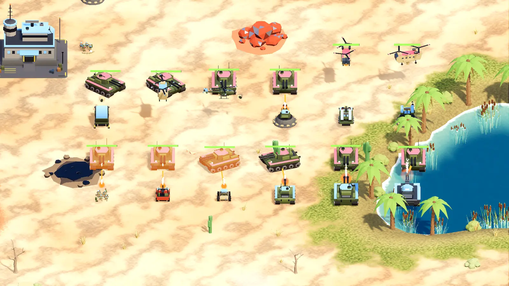

# Ironbound

Ironbound is an open source real-time strategy game made with Godot 4.7. Your city builds
itself; you run the mines, supply lines, trade, diplomacy and the army.

Website: https://cwbhood.github.io/godot-open-rts/

## Features

 - a city that grows from deliveries, with three tiers of buildings and units
 - mines, trucks, trains, storage and a power grid that feed it
 - trade, non-aggression pacts and alliances with AI rivals
 - AI opponents at several difficulty levels and an opt-in helper AI
 - desert and island maps, weather, water and amphibious units, start-zone picking
 - line, fight, patrol and guard orders, stances and Shift queues
 - replays, a map editor and moddable data files in `data/`
 - a tutorial and an in-game manual (F1)

## Playing from source

Open the folder in Godot 4.7 and press Play, or run `godot --path .`.

## Testing

`play` (Windows) or `./play.sh` plays every test scenario and writes a report to
`harness-out/`. See [docs/testing/play-harness.md](docs/testing/play-harness.md) for
scenarios, batches across maps and AIs, stress runs and the scripting API.

## Contributing

Bug fixes and refactors are welcome as pull requests. For features, open an issue first.

## Credits

Ironbound grew from [Open RTS](https://github.com/lampe-games/godot-open-rts) by Pawel Lampe
(Lampe Games), MIT licence. See [ASSET_CREDITS.md](ASSET_CREDITS.md) for every asset and its
licence, and [LOGO_LICENSES.md](LOGO_LICENSES.md) for logos.
