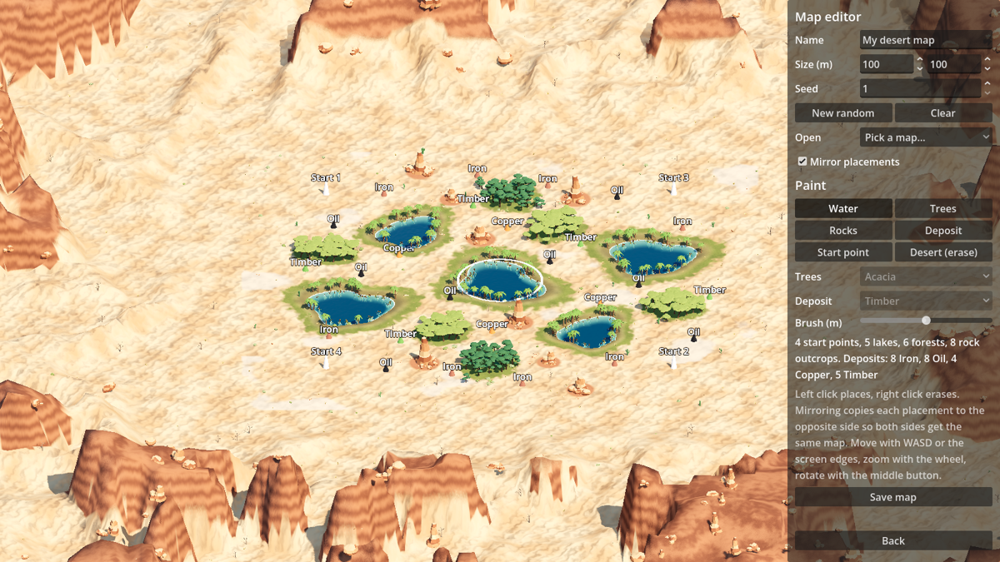

# Map editor

The quickest way to make a map is the in-game editor: **Main menu → Map editor**.



## Making a map

1. Pick a size and press **New random** for a generated starting point, or **Clear** for
   empty desert with two start points. **Open** loads a map you saved before or one of
   the built-in desert maps.
2. Choose a paint tool and left-click on the map:
   - **Lake** drops a lake (the brush sets its size),
   - **Island** raises a round island out of the sea (only on sea maps, see below),
   - **Shallows (ford)** lays shallow water that every unit can wade through: a ford
     between two islands, or a shallow pool in a lake,
   - **Trees** plants a forest of acacia, pine or mixed trees; clicking next to a forest
     of the same kind grows it,
   - **Rocks** places a rock outcrop that units walk around,
   - **Deposit** places an oil, iron, copper or timber deposit for constructors to
     harvest,
   - **Start point** places where a faction's city begins,
   - **Desert (erase)** removes whatever is under the cursor. Right-click erases with any
     tool.
3. Tick **Sea** to flood the whole map: land is then only where you put islands. Each
   start point gets an island of its own when you switch it on. Land units cannot cross
   deep water; boats and amphibious units can (see [Water](water.md)). The editor refuses
   to save while a start point or deposit stands in water.
4. Leave **Mirror placements** on to copy every placement to the opposite side of the
   map (point symmetry), so both sides get an equally good map.
5. Give it a name and press **Save map**. It shows up in the Play menu straight away.

The map is rebuilt after every change, so you see the shores, trees and sand exactly as
they will look in a match.

## Where maps are saved

Saved maps are a small mod in your user folder:

| File | What it is |
| --- | --- |
| `user://mods/custom_maps/data/maps/<id>.json` | the map: size, seed and everything you placed |
| `user://mods/custom_maps/maps/<id>.tscn` | a two-line scene pointing the desert map at that file |

`user://` is `%APPDATA%\Godot\app_userdata\Open RTS` on Windows,
`~/.local/share/godot/app_userdata/Open RTS` on Linux and
`~/Library/Application Support/Godot/app_userdata/Open RTS` on macOS.

To share a map, send both files; the other player puts them in the same folders. To add
a map to the game itself, copy the JSON to `data/maps/`, copy
`source/match/maps/DesertExpanse.tscn` to `source/match/maps/<Name>.tscn`, set its
`map_definition` to `res://data/maps/<id>.json` and point the JSON's `scene` at the new
scene. Then run the validator (see [Make a map](make-a-map.md#4-check-and-play-it)).

## The map file

```json
{
  "id": "twin_oases",
  "name": "Twin Oases",
  "scene": "user://mods/custom_maps/maps/twin_oases.tscn",
  "players": 2,
  "size": [100, 100],
  "generator": {"seed": 4},
  "layout": {
    "spawns": [[16, 16], [84, 84]],
    "lakes": [{"center": [50, 50], "radius": 7}],
    "forests": [{"kind": "pine", "circles": [{"center": [30, 62], "radius": 3}]}],
    "outcrops": [{"center": [70, 30], "radius": 2.5}],
    "deposits": [{"kind": "oil", "center": [25, 35]}, {"kind": "iron", "center": [75, 65], "amount": 900}],
    "sea": false,
    "islands": [],
    "water": [{"center": [50, 38], "radius": 3, "depth": "shallow"}]
  }
}
```

Everything is in metres from the map's top-left corner. Without `"layout"` the generator
places everything itself from `"seed"` and these optional settings:

| Setting | Meaning |
| --- | --- |
| `seed` | changes dunes, sand patterns, small props (and the layout, when there is none) |
| `resource_layout` | `"symmetric"` or `"asymmetric"` (one side oil-rich, the other metal-rich) |
| `lake_pairs`, `forest_pairs`, `outcrop_pairs` | how many mirrored pairs of each to place |

`sea`, `islands` and `water` are described in [Water](water.md). A deposit's `amount` is optional; without it the default from `data/resources.json` is
used.

## What it can't do yet

- Only desert maps: there is no height painting, cliffs, rivers or other biomes. The
  dunes and mesas around the map come from the seed.
- Lakes, islands, shallows, forests and rocks are circles in the editor (a map file can
  also use strips and polygons for water, see [Water](water.md)). Overlap several to make other shapes.
- Mirroring is point symmetry around the centre only. For four players place the second
  pair of start points yourself.
- No undo; erase what you don't want.
- The editor doesn't play-test: save, then pick the map in the Play menu.
