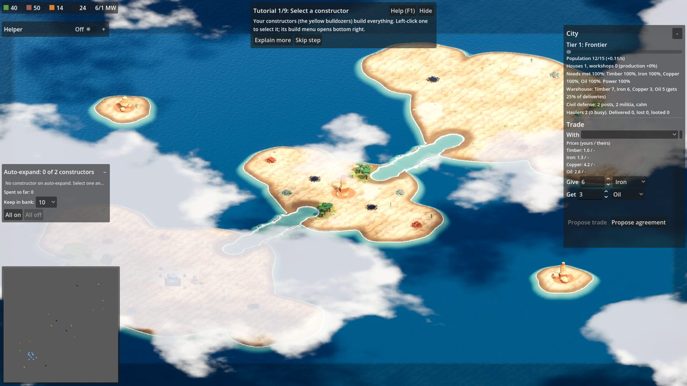

# Water



Maps can have water that only some units cross: a sea with islands, lakes, channels and
shallow fords. Twin Isles (`data/maps/twin_isles.json`) is the example: each faction
starts on its own island with its basic deposits, and the rich deposits sit on a centre
island that both sides fight over.

## How units move on water

| Water | Land units | Amphibious units | Boats |
| --- | --- | --- | --- |
| Land | yes | yes | no |
| Shallow water (fords) | yes, at 55% speed | yes | yes |
| Deep water | no | yes, at their `water_speed` | yes |

Amphibious units slow down while they climb in or out of the water and float lower while
swimming. Aircraft ignore water. Nothing can be built in water, fords included; a
structure marked `"placement": "shore"` (the shipyard) must stand on land right next to
deep water.

Each kind of unit has its own navigation map (land, water and amphibious), so a land unit
ordered across the sea stops on the shore instead of trying to swim.

## Water in a map file

These keys go in a map's `"layout"` (see [Map editor](map-editor.md#the-map-file)).
Everything is in metres from the map's top-left corner.

```json
"sea": true,
"islands": [
  {"center": [38, 122], "radius": 27},
  {"points": [[70, 10], [90, 12], [84, 30]]}
],
"water": [
  {"center": [64, 64], "radius": 6, "depth": "deep"},
  {"from": [53, 107], "to": [71, 89], "radius": 3.5, "depth": "shallow"},
  {"points": [[10, 10], [30, 10], [20, 25]], "depth": "deep"}
]
```

| Key | Meaning |
| --- | --- |
| `sea` | `true` floods the whole map with deep water except the islands |
| `islands` | land shapes cut out of the sea (ignored without `sea`) |
| `water` | extra water on land or in the sea; `depth` is `"deep"` (default) or `"shallow"` |
| `lakes` | the older round lakes; they count as deep water |

A shape is a circle (`center`, `radius`), a strip (`from`, `to`, `radius`: a ford, river
or channel) or a polygon (`points`, at least 3). Circles and strips get a slightly wavy
coast. Shallow water wins over deep water, so a shallow strip across a channel makes a
ford.

Rules the validator checks (`godot --headless --path . -s res://tools/validate_data.gd`):
start points and deposits must be at least 1.5 m from any water.

## Water units in data/units

| Field | Meaning |
| --- | --- |
| `movement` | `"land"` (default), `"water"` (boats) or `"amphibious"` |
| `water_speed` | amphibious units only: speed in m/s on water (default: `speed`) |
| `placement` | structures only: `"shore"` keeps it on land next to deep water |

Example, a data-only boat built by the shipyard:

```json
{
  "id": "patrol_boat",
  "base": "tank",
  "movement": "water",
  "model": "res://assets/models/ironbound/units/patrol_boat.glb",
  "speed": 3.6,
  "produced_by": ["shipyard"]
}
```

A new unit appears on the closest spot its own navigation map allows: a boat on the
nearest water, a land unit on the nearest land.

## The AI

The computer players check whether they can reach an enemy by land. When they cannot,
their vehicle factories build the amphibious APC instead of tanks. Battle groups skip
targets their units cannot reach, and constructors (the AI's, and auto-expand) skip
deposits across deep water.

## Tests

- `godot --headless --path . res://tests/water/WaterMovement.tscn` checks that a tank
  cannot reach a separate island, wades a ford, that the amphibious APC crosses and a
  boat sails around the islands, plus frame time and rebake cost.
- `godot --headless --path . -s res://tests/perf/WaterMapTiming.gd` times generating and
  baking Twin Isles.
